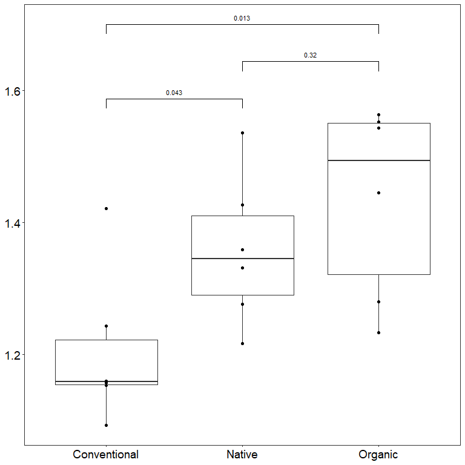
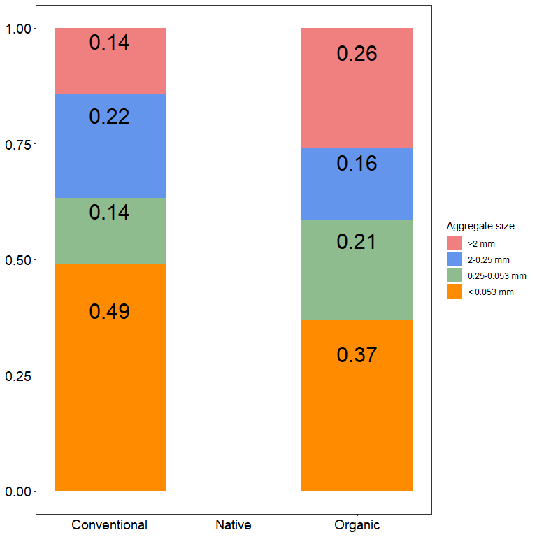
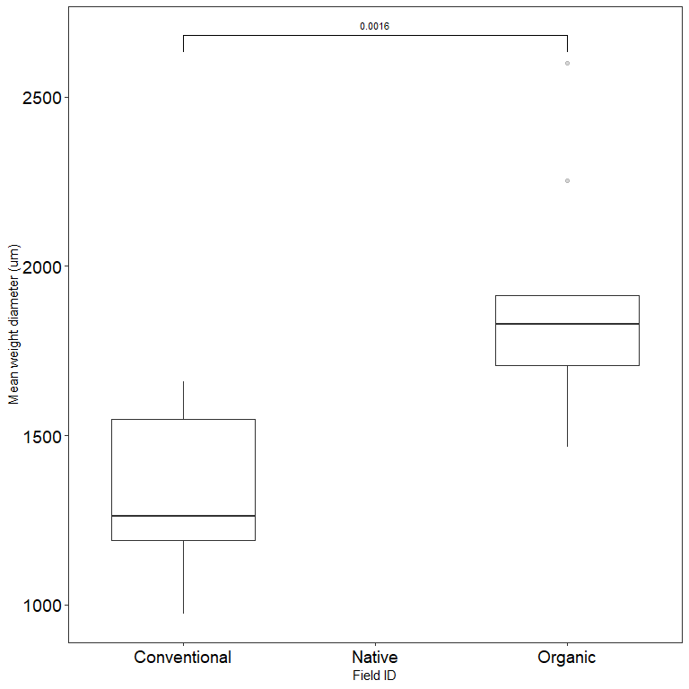
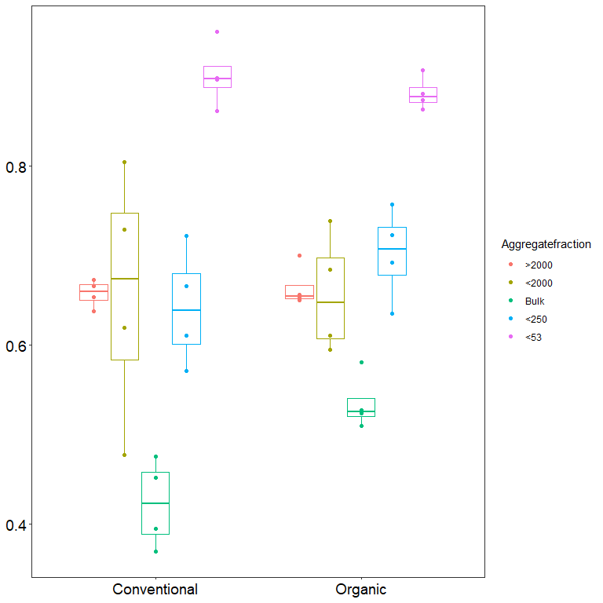
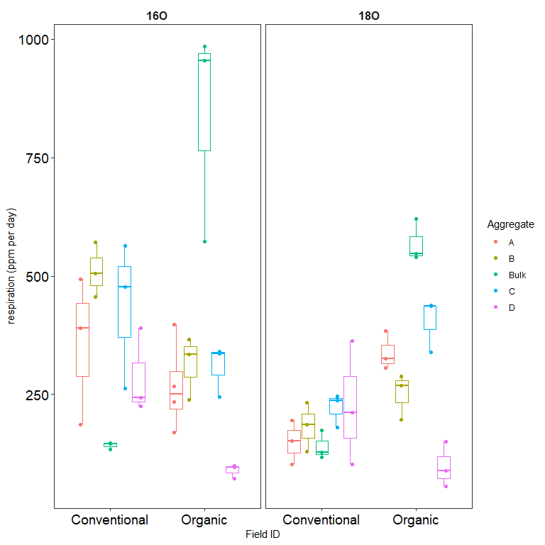
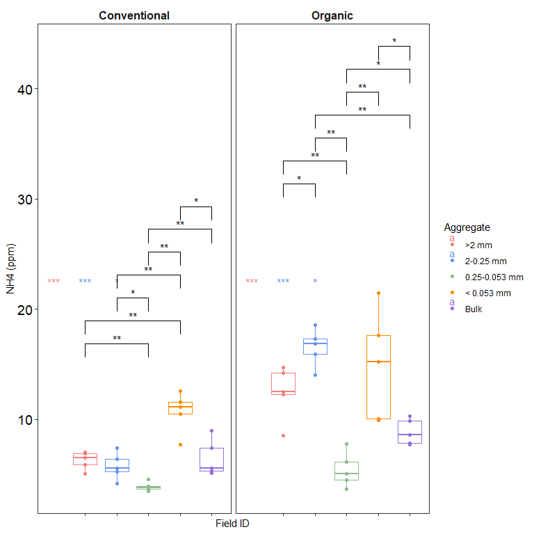

CUE_Davis_Soil_report
================

## Soil description

click to open

##### Soil samples were collected from Russell Ranch in early 2024. Trenched plots were established and weeded to minimize the impact of roots and plant communities on soil properties. Despite being fallowed, conventional plots were still treated with herbicides, leading to differences in plant abundance and community composition across fields.

##### The soils were sieved through an 8 mm mesh and stored at -80°C until fractionation. Each sample underwent two rounds of fractionation. In the first round, soils were sieved, and the resulting aggregates were dried to assess physical properties. Dried aggregates were archived for potential future use. The second round involved sieving without drying, processing only two samples at a time to maintain soil moisture. Soil moisture was adjusted to approximately 60% of the water holding capacity, determined for each aggregate class from the first sieve.

##### Following this, subsamples were processed as follows: some soils were stored in 1.7 mL tubes at -80°C, 2 g of soil was incubated with ^18O-labeled H₂O to assess carbon use efficiency (CUE), and two 5 g subsamples were used to determine microbial biomass carbon (C) and nitrogen (N). After the CUE incubation, gas samples were taken from the headspace to measure respiration rates. DNA was then extracted from the soils to analyze ^18O incorporation into DNA during the 24-hour incubation.

## Soil physical properties by site

click to open

#### Water infiltration measured in the field n=6

click to open

##### we see a clear difference between the conventional soils and organic/native plots. Organic and Native grass prairie also were significantly different from eachother with Native grass prairie soils having the fastest infiltration rate

#### Bulk density of field soil n=6

click to open

##### Bulk density did significantly varry between conventional and organic/native. However the bulk density of organic and Native were similar. Organic had a much higher average, but the data was less even compared to Native prairie soils.

#### Proportion of each aggregate size by mass n=9

click to open

##### In general the organic soils have higher levels of aggregation for almost all sizes except 2-0.25 mm. Distribution of aggregates by mass is more even in organic soils. These proportions do not match previous data: methods or time/space?

#### g dry per g wet soil after fractionation, and by aggregate size. n=4

click to open

##### this data helped constrain the moisture after wet-sieve. Note that a centrifuge technique was implemented to account for this variation. aggregates were mixed with extra water and shaken vigorously, then centrifuged at 10000 rmp for 15 min. After which the pellet was measured and used to determine moisture.

## Aggregate fractionated experiment

click to open

## Session Info

Session Info

Date run: 2024-09-03

    ## R version 4.3.2 (2023-10-31 ucrt)
    ## Platform: x86_64-w64-mingw32/x64 (64-bit)
    ## Running under: Windows 11 x64 (build 22631)
    ## 
    ## Matrix products: default
    ## 
    ## 
    ## locale:
    ## [1] LC_COLLATE=English_United States.utf8 
    ## [2] LC_CTYPE=English_United States.utf8   
    ## [3] LC_MONETARY=English_United States.utf8
    ## [4] LC_NUMERIC=C                          
    ## [5] LC_TIME=English_United States.utf8    
    ## 
    ## time zone: America/Los_Angeles
    ## tzcode source: internal
    ## 
    ## attached base packages:
    ## [1] grid      stats     graphics  grDevices utils     datasets  methods  
    ## [8] base     
    ## 
    ## other attached packages:
    ##  [1] ropls_1.34.0        trelliscopejs_0.2.6 pmartR_2.4.1       
    ##  [4] agricolae_1.3-7     knitr_1.45          nlme_3.1-163       
    ##  [7] cowplot_1.1.1       ggpubr_0.6.0        janitor_2.2.0      
    ## [10] pracma_2.4.4        reshape2_1.4.4      ggbiplot_0.55      
    ## [13] scales_1.3.0        vegan_2.6-4         lattice_0.21-9     
    ## [16] permute_0.9-7       lubridate_1.9.3     forcats_1.0.0      
    ## [19] stringr_1.5.1       purrr_1.0.2         readr_2.1.4        
    ## [22] tidyr_1.3.0         tibble_3.2.1        ggplot2_3.4.4      
    ## [25] tidyverse_2.0.0     dplyr_1.1.4         plyr_1.8.9         
    ## [28] tarchetypes_0.7.9   targets_1.3.2      
    ## 
    ## loaded via a namespace (and not attached):
    ##  [1] bitops_1.0-7                MultiDataSet_1.30.0        
    ##  [3] rlang_1.1.2                 magrittr_2.0.3             
    ##  [5] snakecase_0.11.1            matrixStats_1.2.0          
    ##  [7] compiler_4.3.2              mgcv_1.9-0                 
    ##  [9] callr_3.7.3                 vctrs_0.6.4                
    ## [11] pkgconfig_2.0.3             crayon_1.5.2               
    ## [13] fastmap_1.1.1               XVector_0.42.0             
    ## [15] backports_1.4.1             labeling_0.4.3             
    ## [17] utf8_1.2.4                  rmarkdown_2.25             
    ## [19] tzdb_0.4.0                  ps_1.7.5                   
    ## [21] MultiAssayExperiment_1.28.0 xfun_0.41                  
    ## [23] zlibbioc_1.48.0             GenomeInfoDb_1.38.5        
    ## [25] jsonlite_1.8.8              progress_1.2.2             
    ## [27] highr_0.10                  DelayedArray_0.28.0        
    ## [29] broom_1.0.5                 parallel_4.3.2             
    ## [31] prettyunits_1.2.0           cluster_2.1.4              
    ## [33] R6_2.5.1                    DistributionUtils_0.6-1    
    ## [35] stringi_1.8.2               limma_3.58.1               
    ## [37] car_3.1-2                   GenomicRanges_1.54.1       
    ## [39] Rcpp_1.0.11                 SummarizedExperiment_1.32.0
    ## [41] iterators_1.0.14            base64enc_0.1-3            
    ## [43] IRanges_2.36.0              Matrix_1.6-1.1             
    ## [45] splines_4.3.2               igraph_1.5.1               
    ## [47] timechange_0.2.0            tidyselect_1.2.0           
    ## [49] rstudioapi_0.15.0           abind_1.4-5                
    ## [51] yaml_2.3.7                  AlgDesign_1.2.1            
    ## [53] codetools_0.2-19            processx_3.8.2             
    ## [55] Biobase_2.62.0              withr_2.5.2                
    ## [57] evaluate_0.23               mclust_6.0.1               
    ## [59] pillar_1.9.0                MatrixGenerics_1.14.0      
    ## [61] carData_3.0-5               checkmate_2.3.0            
    ## [63] foreach_1.5.2               stats4_4.3.2               
    ## [65] generics_0.1.3              RCurl_1.98-1.14            
    ## [67] hms_1.1.3                   S4Vectors_0.40.2           
    ## [69] munsell_0.5.0               calibrate_1.7.7            
    ## [71] base64url_1.4               glue_1.6.2                 
    ## [73] tools_4.3.2                 data.table_1.14.8          
    ## [75] webshot_0.5.5               ggsignif_0.6.4             
    ## [77] fs_1.6.3                    colorspace_2.1-0           
    ## [79] GenomeInfoDbData_1.2.11     cli_3.6.1                  
    ## [81] fansi_1.0.5                 S4Arrays_1.2.0             
    ## [83] gtable_0.3.4                autocogs_0.1.4             
    ## [85] rstatix_0.7.2               digest_0.6.33              
    ## [87] BiocGenerics_0.48.1         SparseArray_1.2.3          
    ## [89] farver_2.1.1                htmltools_0.5.7            
    ## [91] lifecycle_1.0.4             statmod_1.5.0              
    ## [93] qqman_0.1.9                 MASS_7.3-60

